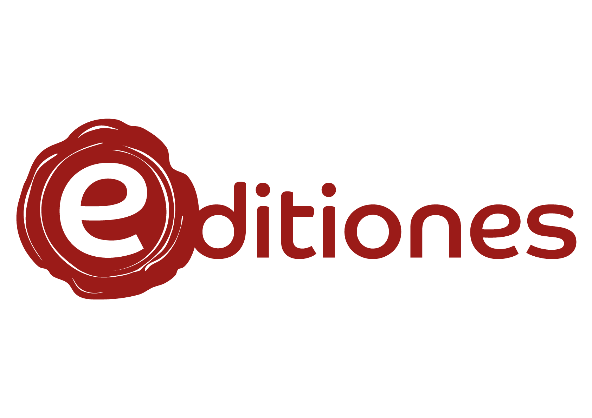

# 17th c. French texts corpus.

This repository contains a corpus of 17h c. French texts.

## Data

The project E-ditiones aims to encode severals 17th century French manuscripts and printed documents. We chose various literary genres, like drama, letters or novels.

Soon, you will find here a list of all encoded texts.

## Schemas and documentation

Texts are encoded following the rules of [ODD17](https://github.com/e-ditiones/ODD17), where you can find :

* the [documentation](https://github.com/e-ditiones/ODD17/tree/master/Documentation)
* the [ODDs](https://github.com/e-ditiones/ODD17/tree/master/ODDs) (we use the ODD chaining)
* the [RNG schemas](https://github.com/e-ditiones/ODD17/tree/master/schemas)

## Application

All texts are available on [APP17](https://github.com/e-ditiones/APP17), a web publication app built with [TEI Publisher](https://teipublisher.com/index.html).

This application is now available online : [https://e-ditiones.huma-num.fr](https://e-ditiones.huma-num.fr).

## Credits

This repository is developed by Alexandre Bartz with the help of Simon Gabay, as part of the [_E-ditiones_](https://github.com/e-ditiones) project.

## Licence

This repository is CC-BY-SA.
 

## Cite this repository

Alexandre Bartz, Simon Gabay. 2020. _17th c. French texts corpus._ Retrieved from https://github.com/e-ditiones/CORPUS17.

